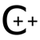
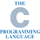
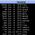
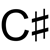

Hello to all inventors
======================

The aim of this project is to send e-mail to all the inventors of most popular programming languages.

The message of the e-mail:

```
Hello!
I'm a super-duper programmer.
I can write "Hello, world" in all urgent programming languages!
So, please hire me.
```

[](https://developer.mozilla.org/en-US/docs/Web/JavaScript/Guide/Introduction)
[](https://docs.oracle.com/javase/tutorial/getStarted/application/index.html)
[](https://wiki.python.org/moin/SimplePrograms)
[](http://www.css3-tutorial.net/introduction/hello-css-world/)
[](https://www.w3schools.com/php/php_syntax.asp)
[](https://www.ruby-lang.org/en/documentation/quickstart/)
[](https://en.wikibooks.org/wiki/C%2B%2B_Programming/Examples/Hello_world)
[](https://en.wikipedia.org/wiki/%22Hello,_World!%22_program)
[](https://www.shellscript.sh/first.html)
[](https://docs.microsoft.com/en-us/dotnet/csharp/programming-guide/inside-a-program/hello-world-your-first-program)
[](https://www.journaldev.com/9512/objective-c-hello-world-tutorial)
[](https://www.r-project.org)
[](http://www.vim.org)
[](https://tour.golang.org/welcome/1)
[](https://www.perl.org/learn.html)
[](http://coffeescript.org)
[](https://www.latex-project.org/about/)
[](https://developer.apple.com/library/content/documentation/Swift/Conceptual/Swift_Programming_Language/GuidedTour.html)
[](https://www.scala-lang.org/documentation/getting-started.html)
[](https://www.gnu.org/software/emacs/manual/html_node/elisp/index.html)
[](https://wiki.haskell.org/Haskell_in_5_steps)
[](http://www.lua.org/pil/1.html)
[](https://clojure.org/about/functional_programming)
[](https://www.mathworks.com/help/coder/examples/hello-world.html)
[](https://www.arduino.cc/en/Tutorial/HelloWorld)
[](http://groovy-lang.org/syntax.html)
[](https://puppet.com/docs/puppet/5.0/quick_start_helloworld.html)
[](https://doc.rust-lang.org/1.1.0/book/hello-world.html)
[](https://technet.microsoft.com/en-us/library/bb963733.aspx)
[](http://pubs.opengroup.org/onlinepubs/9699919799/utilities/make.html)

