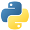
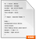
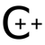
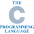
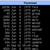
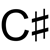

Languages and Creators
======================

1.  JavaScript
 — [Brendan Eich](https://en.wikipedia.org/wiki/Brendan_Eich)

2.  Java
 — [James Gosling](https://en.wikipedia.org/wiki/James_Gosling)

3.  Python
 — [Guido van Rossum](https://en.wikipedia.org/wiki/Guido_van_Rossum)

4.  CSS
 — [Håkon Wium Lie](https://en.wikipedia.org/wiki/Håkon_Wium_Lie)

5.  PHP
 — [Rasmus Lerdorf](https://en.wikipedia.org/wiki/Rasmus_Lerdorf)

6.  Ruby
 — [Yukihiro Matsumoto](https://en.wikipedia.org/wiki/Yukihiro_Matsumoto)

7.  C++
 — [Bjarne Stroustrup](https://en.wikipedia.org/wiki/Bjarne_Stroustrup)

8.  C
 — [Dennis Ritchie](https://en.wikipedia.org/wiki/Dennis_Ritchie)

9.  Shell
 — [Stephen Richard "Steve" Bourne](https://en.wikipedia.org/wiki/Stephen_R._Bourne)

10.  C#
 — [Anders Hejlsberg](https://en.wikipedia.org/wiki/Anders_Hejlsberg)

11.  Objective C
 — [Brad Cox](https://en.wikipedia.org/wiki/Brad_Cox)

12.  R
 — [Ross Ihaka](https://en.wikipedia.org/wiki/Ross_Ihaka)

13.  VimL
 — [Bram Moolenaar](https://en.wikipedia.org/wiki/Bram_Moolenaar)

14.  Go
 — [Robert Griesemer](https://github.com/griesemer)

15.  Perl
 — [Larry Wall](https://en.wikipedia.org/wiki/Larry_Wall)

16.  CoffeeScript
 — [Jeremy Ashkenas](https://github.com/jashkenas)

17.  TEX
 — [Donald Knuth](https://en.wikipedia.org/wiki/Donald_Knuth)

18.  Swift
 — [Chris Lattner](https://en.wikipedia.org/wiki/Chris_Lattner)

19.  Scala
 — [Martin Odersky](https://en.wikipedia.org/wiki/Martin_Odersky)

20.  Lisp
 — [John McCarthy](https://en.wikipedia.org/wiki/John_McCarthy_(computer_scientist))

21.  Haskel
 — [Lennart Augustsson](https://en.wikipedia.org/wiki/Lennart_Augustsson)

22.  Lua
 — [Roberto Ierusalimschy](https://en.wikipedia.org/wiki/Roberto_Ierusalimschy)

23.  Clojure
 — [Rich Hickey](https://github.com/richhickey)

24.  Matlab
 — [Cleve Moler](https://en.wikipedia.org/wiki/Cleve_Moler)

25.  Arduino
 — [Massimo Banzi](https://www.ted.com/talks/massimo_banzi_how_arduino_is_open_sourcing_imagination)

26.  Groovy
 — [Guillaume Laforge](https://github.com/glaforge)

27.  Puppet
 — [Luke Kanies](https://puppet.com/company/leadership/luke-kanies)

28.  Rust
 — [Graydon Hoare](https://github.com/graydon)

29.  PowerShell
 — [Jeffrey Snover](https://en.wikipedia.org/wiki/Jeffrey_Snover)

30.  Makefile
 — [Stuart Feldman](https://en.wikipedia.org/wiki/Stuart_Feldman)
